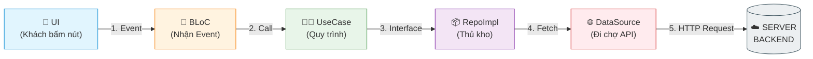
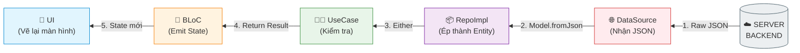
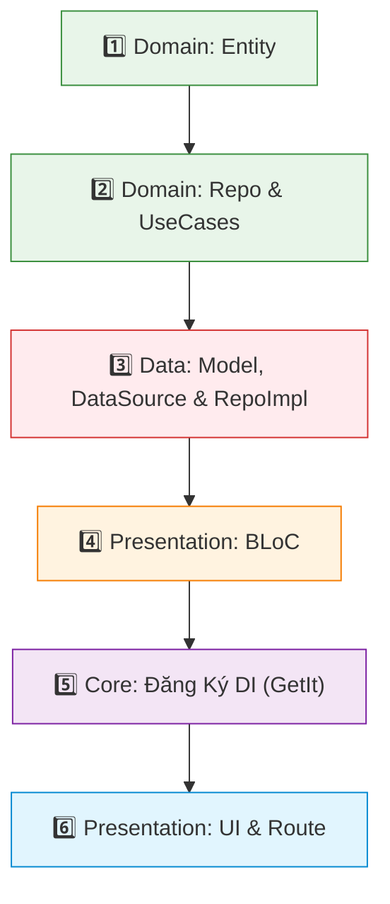

# ⛩️ HƯỚNG DẪN XÂY DỰNG FEATURE MODULE
> **Kiến trúc:** Clean Architecture (Feature-Based)  
> **Dự án:** Gia Tộc Việt  

---

## 🍽️ 1. Mô Hình Ẩn Dụ "Nhà Hàng Cao Cấp"

> [!TIP]
> Tưởng tượng ứng dụng của bạn là một **Nhà Hàng 5 Sao**. Mọi thành phần đều có vai trò riêng biệt!

| Tầng trong Code | Ẩn Dụ Nhà Hàng | Vai Trò & Nhiệm Vụ Chi Tiết |
| :--- | :--- | :--- |
| **User** | 👤 **Khách Hàng** | Người trực tiếp dùng app, bấm nút gọi món |
| **UI (Page/Widget)** | 🍽️ **Bàn Ăn & Menu** | Nơi bày trí món ăn đẹp mắt cho khách xem |
| **BLoC / Cubit** | 🤵 **Bồi Bàn** | Nhận order (Event) ➡️ Báo vào bếp ➡️ Mang món ra (State) |
| **UseCase (Domain)** | 👨‍🍳 **Công Thức Nấu** | Quy trình làm 1 món (VD: `GetEvents`, `SaveEvent`) |
| **Entity (Domain)** | 🍲 **Món Ăn Hoàn Chỉnh** | Đĩa thức ăn ngon sạch đã chế biến (`@freezed`) |
| **Repository Interface** | 📜 **Tờ Hợp Đồng** | Bếp ghi rõ: *"Tôi cần nguyên liệu đạt chuẩn này!"* |
| **Repository Impl** | 📦 **Anh Thủ Kho** | Ký hợp đồng (`implements`), đi chợ & rửa sạch dữ liệu |
| **Data Source** | 🌐 **Chợ Đầu Mối** | Nơi kết nối Internet (Dio/Firebase) kéo JSON thô về |
| **Model** | 🧼 **Máy Rửa Rau** | Ép kiểu dữ liệu, chống null, đóng gói JSON thành Entity |
| **GetIt (DI)** | 👔 **Lễ Tân / Quản Lý** | Nối dây các nhân sự với nhau từ khi mở cửa nhà hàng |

---

## 🔄 2. Sơ Đồ Luồng Dữ Liệu 2 Chiều (Data Flow)

### 🟢 Chiều Đi (Khách Order ➡️ Gửi Request)


### 🔵 Chiều Về (Server Trả Về ➡️ Hiển Thị UI)


---

## 📂 3. Cấu Trúc Thư Mục Chuẩn Cho 1 Feature

```text
lib/features/notifications/
├── 🔵 domain/                   # TRÁI TIM NGHIỆP VỤ (Thuần Dart)
│   ├── entities/               # Lớp dữ liệu (@freezed)
│   ├── repositories/           # Hợp đồng Interface (abstract class)
│   └── usecases/               # Mỗi hành động là 1 UseCase
│
├── 🔴 data/                     # TẦNG DỮ LIỆU (API / Cache)
│   ├── datasources/            # Gọi API thật bằng Dio
│   ├── models/                 # Chuyển đổi JSON <-> Entity
│   └── repositories/           # Thực thi hợp đồng RepoImpl
│
├── 🟡 presentation/             # TẦNG GIAO DIỆN (Flutter / BLoC)
│   ├── bloc/                   # BLoC, Event, State
│   ├── pages/                  # Các màn hình chính
│   └── widgets/                # Các Widget con dùng lại
│
├── 🔌 notifications_injection.dart  # File đăng ký DI GetIt
└── 📦 notifications.dart             # Barrel file export gọn gàng
```

---

## 📋 4. Quy Trình 6 Bước Code Chi Tiết (Từ Trong Ra Ngoài)

> [!IMPORTANT]
> **Quy tắc vàng:** Luôn gõ code từ **Domain** ➡️ **Data** ➡️ **Presentation** ➡️ **DI & Route**.



---

### 🟢 Bước 1: Code Entity (Domain Layer)
📁 **File:** `domain/entities/notification_entity.dart`

```dart
import 'package:freezed_annotation/freezed_annotation.dart';

part 'notification_entity.freezed.dart';

@freezed
class NotificationEntity with _$NotificationEntity {
  const factory NotificationEntity({
    required int id,
    required String title,
    required String content,
    required bool isRead,
  }) = _NotificationEntity;
}
```

> [!NOTE]
> Chạy lệnh terminal sau khi viết Entity:  
> `fvm flutter pub run build_runner build --delete-conflicting-outputs`

---

### 🟢 Bước 2: Code Repo Interface & UseCase (Domain Layer)

📁 **File 1:** `domain/repositories/notifications_repository.dart`
```dart
import 'package:dartz/dartz.dart';
import '../../../../core/errors/failures.dart';
import '../entities/notification_entity.dart';

abstract class NotificationsRepository {
  Future<Either<Failure, List<NotificationEntity>>> getNotifications();
}
```

📁 **File 2:** `domain/usecases/get_notifications.dart`
```dart
import 'package:dartz/dartz.dart';
import '../../../../core/errors/failures.dart';
import '../entities/notification_entity.dart';
import '../repositories/notifications_repository.dart';

class GetNotifications {
  final NotificationsRepository repository;
  GetNotifications(this.repository);

  Future<Either<Failure, List<NotificationEntity>>> call() {
    return repository.getNotifications();
  }
}
```

---

### 🔴 Bước 3: Code Model, DataSource & RepoImpl (Data Layer)

📁 **File 1:** `data/models/notification_model.dart`
```dart
import '../../domain/entities/notification_entity.dart';

class NotificationModel {
  static NotificationEntity fromJson(Map<String, dynamic> json) {
    return NotificationEntity(
      id: json['id'] as int? ?? 0,
      title: json['title'] as String? ?? '',
      content: json['content'] as String? ?? '',
      isRead: json['is_read'] as bool? ?? false,
    );
  }
}
```

📁 **File 2:** `data/datasources/notifications_remote_data_source.dart`
```dart
import '../../../../core/network/dio_client.dart';
import '../../domain/entities/notification_entity.dart';
import '../models/notification_model.dart';

abstract class NotificationsRemoteDataSource {
  Future<List<NotificationEntity>> getNotifications();
}

class NotificationsRemoteDataSourceImpl implements NotificationsRemoteDataSource {
  final DioClient dioClient;
  NotificationsRemoteDataSourceImpl(this.dioClient);

  @override
  Future<List<NotificationEntity>> getNotifications() async {
    final response = await dioClient.get('/notifications');
    return (response.data as List)
        .map((e) => NotificationModel.fromJson(e))
        .toList();
  }
}
```

📁 **File 3:** `data/repositories/notifications_repository_impl.dart`
```dart
import 'package:dartz/dartz.dart';
import '../../../../core/errors/exceptions.dart';
import '../../../../core/errors/failures.dart';
import '../../domain/entities/notification_entity.dart';
import '../../domain/repositories/notifications_repository.dart';
import '../datasources/notifications_remote_data_source.dart';

class NotificationsRepositoryImpl implements NotificationsRepository {
  final NotificationsRemoteDataSource remoteDataSource;
  NotificationsRepositoryImpl(this.remoteDataSource);

  @override
  Future<Either<Failure, List<NotificationEntity>>> getNotifications() async {
    try {
      final result = await remoteDataSource.getNotifications();
      return Right(result);
    } on ServerException catch (e) {
      return Left(ServerFailure(message: e.message));
    } catch (e) {
      return Left(ServerFailure(message: 'Lỗi hệ thống: $e'));
    }
  }
}
```

---

### 🟡 Bước 4: Code BLoC (Presentation Layer)

📁 **File:** `presentation/bloc/notifications_bloc.dart`

```dart
import 'package:flutter_bloc/flutter_bloc.dart';
import '../../domain/entities/notification_entity.dart';
import '../../domain/usecases/get_notifications.dart';

// 1. Events
abstract class NotificationsEvent {}
class FetchNotificationsEvent extends NotificationsEvent {}

// 2. States
abstract class NotificationsState {}
class NotificationsInitial extends NotificationsState {}
class NotificationsLoading extends NotificationsState {}
class NotificationsLoaded extends NotificationsState {
  final List<NotificationEntity> notifications;
  NotificationsLoaded(this.notifications);
}
class NotificationsError extends NotificationsState {
  final String message;
  NotificationsError(this.message);
}

// 3. BLoC
class NotificationsBloc extends Bloc<NotificationsEvent, NotificationsState> {
  final GetNotifications getNotifications;

  NotificationsBloc({required this.getNotifications}) : super(NotificationsInitial()) {
    on<FetchNotificationsEvent>((event, emit) async {
      emit(NotificationsLoading());
      final result = await getNotifications();
      result.fold(
        (failure) => emit(NotificationsError(failure.message)),
        (data) => emit(NotificationsLoaded(data)),
      );
    });
  }
}
```

---

### 🔌 Bước 5: Đăng Ký Dependency Injection (`GetIt`)

📁 **File 1:** `notifications_injection.dart`
```dart
import 'package:get_it/get_it.dart';
import 'data/datasources/notifications_remote_data_source.dart';
import 'data/repositories/notifications_repository_impl.dart';
import 'domain/repositories/notifications_repository.dart';
import 'domain/usecases/get_notifications.dart';
import 'presentation/bloc/notifications_bloc.dart';

void initNotificationsDependencies(GetIt sl) {
  // BLoC
  sl.registerFactory(() => NotificationsBloc(getNotifications: sl()));

  // UseCases
  sl.registerLazySingleton(() => GetNotifications(sl()));

  // Repository
  sl.registerLazySingleton<NotificationsRepository>(
    () => NotificationsRepositoryImpl(sl()),
  );

  // Data Source
  sl.registerLazySingleton<NotificationsRemoteDataSource>(
    () => NotificationsRemoteDataSourceImpl(sl()),
  );
}
```

📁 **File 2:** Thêm vào `lib/core/di/injection_container.dart`
```dart
initNotificationsDependencies(sl);
```

---

### 🎨 Bước 6: Code UI & Khai Báo Router

📁 **File 1:** `presentation/pages/notifications_page.dart`
```dart
import 'package:flutter/material.dart';
import 'package:flutter_bloc/flutter_bloc.dart';
import '../../../../core/di/injection_container.dart';
import '../bloc/notifications_bloc.dart';

class NotificationsPage extends StatelessWidget {
  const NotificationsPage({super.key});

  @override
  Widget build(BuildContext context) {
    return BlocProvider(
      create: (context) => sl<NotificationsBloc>()..add(FetchNotificationsEvent()),
      child: Scaffold(
        appBar: AppBar(title: const Text('Thông Báo Gia Tộc')),
        body: BlocBuilder<NotificationsBloc, NotificationsState>(
          builder: (context, state) {
            if (state is NotificationsLoading) {
              return const Center(child: CircularProgressIndicator());
            }
            if (state is NotificationsError) {
              return Center(child: Text(state.message));
            }
            if (state is NotificationsLoaded) {
              return ListView.builder(
                itemCount: state.notifications.length,
                itemBuilder: (context, index) {
                  final item = state.notifications[index];
                  return ListTile(
                    title: Text(item.title),
                    subtitle: Text(item.content),
                  );
                },
              );
            }
            return const SizedBox.shrink();
          },
        ),
      ),
    );
  }
}
```

📁 **File 2:** Thêm vào `lib/core/routes/app_router.dart`
```dart
GoRoute(
  path: '/notifications',
  builder: (context, state) => const NotificationsPage(),
),
```

---

> [!TIP]
> 💡 **Mẹo làm cực nhanh:** Mở thư mục `lib/features/events/` có sẵn trong dự án làm template mẫu. Mỗi khi tạo tính năng mới, bạn chỉ cần thay chữ `Event` ➡️ thành tên tính năng mới (`Notification`, `Album`, `FamilyTree`...)!
