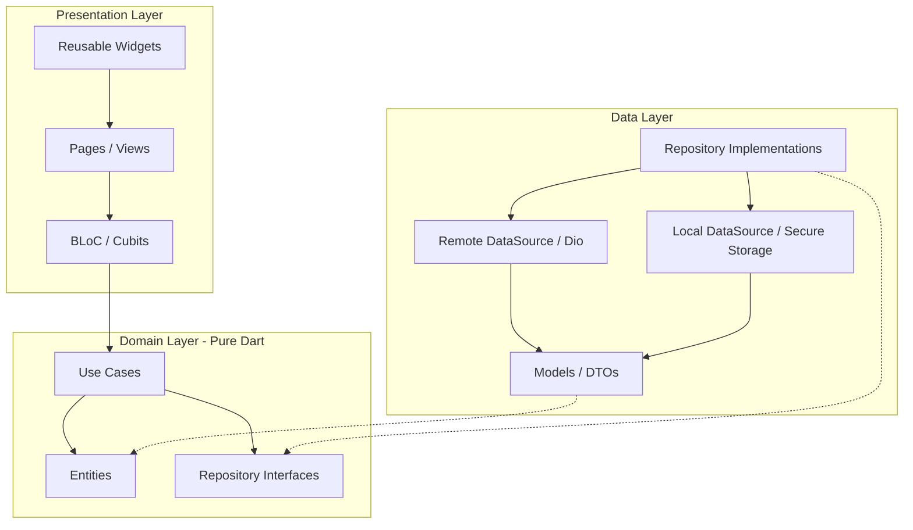

<div align="center">

  

  # 🇻🇳 GIA TỘC VIỆT (Huynh Genealogy)
  
  **Nền Tảng Quản Lý Gia Phả & Kết Nối Dòng Họ Thông Minh**

  [](https://flutter.dev)
  [](https://dart.dev)
  [](https://blog.cleancoder.com/uncle-bob/2012/08/13/the-clean-architecture.html)
  [](https://bloclibrary.dev)
  []()
  []()

  <p align="center">
    <a href="#-tổng-quan">Tổng Quan</a> •
    <a href="#-tính-năng-chính">Tính Năng</a> •
    <a href="#-kiến-trúc--công-nghệ">Kiến Trúc</a> •
    <a href="#-cấu-trúc-thư-mục">Cấu Trúc</a> •
    <a href="#-bắt-đầu">Bắt Đầu</a> •
    <a href="#-quy-chuẩn-phát-triển">Quy Chuẩn</a> •
    <a href="#-đóng-góp">Đóng Góp</a>
  </p>
</div>

---

## 📖 Tổng Quan

**Gia Tộc Việt** là ứng dụng di động toàn diện giúp lưu giữ cội nguồn, kết nối các thế hệ và số hóa cây gia phả dòng họ. Ứng dụng kết hợp giữa nét đẹp văn hóa truyền thống Á Đông (tính toán ngày âm lịch, ngày giỗ, phân bậc thế hệ) cùng công nghệ hiện đại (phả đồ tương tác động, thông báo thông minh qua đám mây, xuất báo cáo PDF chuẩn in ấn).

Được xây dựng trên nền tảng **Flutter** với tư duy **Clean Architecture** và chuẩn quản lý trạng thái **BLoC/Cubit**, dự án đảm bảo tính mở rộng cao, dễ dàng bảo trì và tối ưu hóa hiệu năng trên đa nền tảng.

---

## ✨ Tính Năng Chính

<table>
  <tr>
    <td width="50%">
      <h3>🌳 Phả Đồ Tương Tác Trực Quan</h3>
      <ul>
        <li>Vẽ cây gia phả tự động với <code>GraphView</code> tương tác (Zoom in/out, Pan, Mini-map).</li>
        <li>Phân cấp thế hệ, liên kết nhánh chi tộc, quan hệ trực hệ và phối ngẫu rõ ràng.</li>
        <li>Hồ sơ chi tiết từng thành viên: tiểu sử, hình ảnh, ngày sinh, ngày mất, nơi an nghỉ.</li>
      </ul>
    </td>
    <td width="50%">
      <h3>📅 Lịch Âm & Nhắc Giỗ Thông Minh</h3>
      <ul>
        <li>Tích hợp thuật toán âm lịch Việt Nam (<code>vnlunar</code>) chính xác tuyệt đối.</li>
        <li>Quản lý ngày giỗ, sự kiện tế lễ, họp mặt dòng họ theo chu kỳ năm.</li>
        <li>Thông báo nhắc nhở tự động trước ngày lễ qua <code>FCM</code> và Local Notifications.</li>
      </ul>
    </td>
  </tr>
  <tr>
    <td width="50%">
      <h3>📄 Xuất Bản & Chia Sẻ</h3>
      <ul>
        <li>Xuất cây gia phả và báo cáo thông tin dòng họ ra định dạng <strong>PDF chuẩn in ấn</strong> (<code>pdf</code>, <code>printing</code>).</li>
        <li>Quét và tạo mã QR để chia sẻ nhanh hồ sơ thành viên / gia phả.</li>
        <li>Lưu hình ảnh trực tiếp vào thư viện thiết bị.</li>
      </ul>
    </td>
    <td width="50%">
      <h3>🛡️ Xác Thực & Quản Trị Phân Quyền</h3>
      <ul>
        <li>Đăng nhập đa phương thức: Email/Mật khẩu, Google Sign-In, Firebase Authentication.</li>
        <li>Lưu trữ phiên an toàn với <code>flutter_secure_storage</code>.</li>
        <li>Phân quyền quản trị (Admin / Thành viên) duyệt yêu cầu tham gia và biên tập cây gia phả.</li>
      </ul>
    </td>
  </tr>
  <tr>
    <td width="50%">
      <h3>🌗 Giao Diện Kép & Đa Ngôn Ngữ</h3>
      <ul>
        <li>Hỗ trợ hoàn hảo cả <strong>Light Mode</strong> và <strong>Dark Mode</strong> với bảng màu thiết kế truyền thống sang trọng.</li>
        <li>Đa ngôn ngữ: Tiếng Việt (mặc định) và Tiếng Anh qua <code>flutter_gen_l10n</code>.</li>
      </ul>
    </td>
    <td width="50%">
      <h3>⚡ Trải Nghiệm Mượt Mà</h3>
      <ul>
        <li>Hiệu ứng chuyển động mượt mà với <code>Lottie</code> và micro-animations.</li>
        <li>Âm thanh nền truyền thống thư thái (<code>audioplayers</code>).</li>
        <li>Tối ưu hóa bộ nhớ đệm hình ảnh qua <code>cached_network_image</code>.</li>
      </ul>
    </td>
  </tr>
</table>

---

## 🏗️ Kiến Trúc & Công Nghệ

Dự án áp dụng mô hình **Clean Architecture** phân lớp chặt chẽ nhằm tách biệt hoàn toàn giữa UI, Business Logic và Data Layer:



### 🛠️ Tech Stack & Thư Viện Chính

| Hạng mục | Công nghệ / Thư viện | Mục đích sử dụng |
|---|---|---|
| **Framework & Engine** | Flutter 3.41.x / Dart 3.0+ | Nền tảng phát triển ứng dụng di động đa nền tảng |
| **SDK Management** | [FVM](https://fvm.app/) | Quản lý và khóa phiên bản Flutter đồng nhất |
| **State Management** | `flutter_bloc`, `bloc_concurrency` | Quản lý luồng trạng thái hướng sự kiện (Event-driven) |
| **Dependency Injection** | `get_it` | Service locator, quản lý vòng đời và tiêm phụ thuộc |
| **Routing & Navigation** | `go_router` | Điều hướng khai báo (Declarative routing) với Deep Linking |
| **Networking** | `dio` | HTTP Client mạnh mẽ xử lý Interceptors, Auth Tokens, Refresh logic |
| **Graph Visualization** | `graphview` | Vẽ biểu đồ cấu trúc cây gia phả trực quan |
| **Lịch & Thời gian** | `vnlunar`, `intl`, `timezone` | Tính toán lịch âm dương Việt Nam và định dạng thời gian |
| **Bảo mật & Cục bộ** | `flutter_secure_storage`, `shared_preferences` | Lưu trữ token và cấu hình người dùng |
| **Code Generation** | `freezed`, `json_serializable`, `build_runner` | Sinh mã bất biến (immutable), mapper JSON tự động |
| **In ấn & Tài liệu** | `pdf`, `printing` | Sinh và in tài liệu gia phả dạng PDF |
| **Cloud & Push** | `firebase_core`, `firebase_messaging`, `firebase_auth` | Dịch vụ đám mây, xác thực và thông báo đẩy |

---

## 📁 Cấu Trúc Thư Mục

```
lib/
├── core/                         # Thành phần dùng chung toàn bộ hệ thống
│   ├── config/                   # Cấu hình môi trường, endpoints, constants
│   ├── di/                       # Dependency Injection (GetIt setup)
│   ├── errors/                   # Định nghĩa Failures và Exceptions chuẩn hóa
│   ├── network/                  # Dio Client, Interceptors, Network checkers
│   ├── routes/                   # Cấu hình định tuyến GoRouter
│   ├── services/                 # Notification, Storage, Permission services
│   ├── theme/                    # AppTheme, bảng màu Dark/Light, Typography
│   ├── utils/                    # Formatters, Validators, Helpers
│   └── widgets/                  # Thư viện UI widgets tái sử dụng dùng chung
│
├── features/                     # Module tính năng theo nghiệp vụ (Feature-first)
│   ├── admin/                    # Quản trị dòng họ & kiểm duyệt
│   ├── auth/                     # Xác thực, đăng nhập, phân quyền
│   ├── events/                   # Sự kiện, ngày giỗ, lịch âm
│   ├── family_tree/              # Cây phả hệ, đồ thị quan hệ, xuất PDF
│   ├── onboarding/               # Màn hình chào đón & thiết lập ban đầu
│   └── user/                     # Thông tin cá nhân & cài đặt tài khoản
│       ├── data/                 # Models, DataSources, Repository Impl
│       ├── domain/               # Entities, UseCases, Repository Interfaces
│       └── presentation/         # Pages, Widgets, BLoC/Cubit
│
├── resources/                    # Quản lý Đa ngôn ngữ (Localization)
│   ├── app_en.arb                # Bản dịch Tiếng Anh
│   └── app_vi.arb                # Bản dịch Tiếng Việt (Gốc)
│
└── main.dart                     # Điểm khởi chạy ứng dụng (App Entrypoint)
```

---

## 🚀 Bắt Đầu

### 📋 Yêu Cầu Tiên Quyết

* **FVM (Flutter Version Management)**: [Hướng dẫn cài đặt FVM](https://fvm.app/documentation/getting-started/installation)
* **Flutter SDK**: Khuyên dùng phiên bản `3.41.6` (được cấu hình trong `.fvmrc`)
* **Xcode** (dành cho iOS/macOS) & **Android Studio** (dành cho Android)

### ⚙️ Cài Đặt

1. **Clone repository về máy**:
   ```bash
   git clone https://github.com/ThachDev/Huynh_Genealogy.git
   cd Gia_Toc_Viet
   ```

2. **Cài đặt phiên bản Flutter chuẩn qua FVM**:
   ```bash
   fvm install
   fvm use
   ```

3. **Cài đặt dependencies**:
   ```bash
   fvm flutter pub get
   ```

4. **Sinh mã nguồn tự động (Freezed, JSON Serialization, Localization)**:
   ```bash
   fvm flutter gen-l10n
   fvm flutter pub run build_runner build --delete-conflicting-outputs
   ```

5. **Chạy ứng dụng trong môi trường phát triển (Debug)**:
   ```bash
   fvm flutter run
   ```

---

## 📱 Build & Đóng Gói Ứng Dụng

<details>
<summary><b>🤖 Build Android (APK / App Bundle)</b></summary>

```bash
# Build APK cho môi trường Release
fvm flutter build apk --release

# Build App Bundle để phát hành lên Google Play Store
fvm flutter build appbundle --release
```
</details>

<details>
<summary><b>🍎 Build iOS (IPA)</b></summary>

```bash
# Build iOS Release
fvm flutter build ios --release

# Build file .ipa để phát hành lên App Store / TestFlight
fvm flutter build ipa --release
```
</details>

---

## 🧪 Kiểm Thử & Đảm Bảo Chất Lượng Mã Nguồn

Dự án áp dụng quy chuẩn nghiêm ngặt về phân tích tĩnh (Static Analysis) và Unit Testing:

```bash
# Phân tích mã nguồn theo rules trong analysis_options.yaml
fvm flutter analyze

# Chạy toàn bộ Unit Tests & Widget Tests
fvm flutter test
```

---

## 🎨 Thiết Kế & Quy Chuẩn UI/UX

* **Hai chế độ giao diện**: Bắt buộc hỗ trợ đầy đủ `Light Mode` và `Dark Mode` trên mọi widget mới.
* **Component dùng chung**: Tuyệt đối không tự viết style cứng (`hardcoded styling`). Sử dụng hệ thống widget chuẩn tại `core/widgets/` và token màu sắc tại `core/theme/`.
* **Đa ngôn ngữ**: Không viết chữ trực tiếp vào giao diện (hardcoded strings). Mọi văn bản hiển thị phải được khai báo trong `resources/app_vi.arb` & `app_en.arb` và truy xuất qua `AppLocalizations.of(context)`.

---

## 🤝 Quy Chuẩn Phát Triển & Git Workflow

### 🌿 Chiến lược phân nhánh (Branching Strategy)

* `main` / `master`: Nhánh production ổn định, sẵn sàng release.
* `develop`: Nhánh tích hợp mã nguồn chính trong quá trình phát triển.
* `feature/<tên-tính-năng>`: Nhánh phát triển tính năng mới (ví dụ: `feature/tree-pdf-export`).
* `fix/<tên-lỗi>`: Nhánh sửa lỗi từ `develop`.
* `hotfix/<tên-lỗi>`: Nhánh sửa lỗi khẩn cấp trực tiếp trên `main`.

### 📝 Quy ước Commit (Conventional Commits)

```
feat:     Thêm tính năng mới (e.g. feat: add lunar calendar reminder)
fix:      Sửa lỗi hệ thống (e.g. fix: graph node overlap on tablet)
refactor: Tái cấu trúc mã nguồn không làm thay đổi hành vi
style:    Căn chỉnh UI, formatting, không đổi logic
docs:     Cập nhật tài liệu kỹ thuật, README
test:     Thêm hoặc sửa đổi unit/widget test
chore:    Cập nhật build scripts, config, packages
```

---

## 📄 Bản Quyền & Giấy Phép

Dự án được bảo hộ bản quyền và phát triển bởi **ThachDev / Huynh Genealogy Team**. Mọi quyền được bảo lưu.

<div align="center">
  <sub>Được xây dựng với ❤️ nhằm gìn giữ và tôn vinh truyền thống gia tộc Việt Nam.</sub>
</div>
